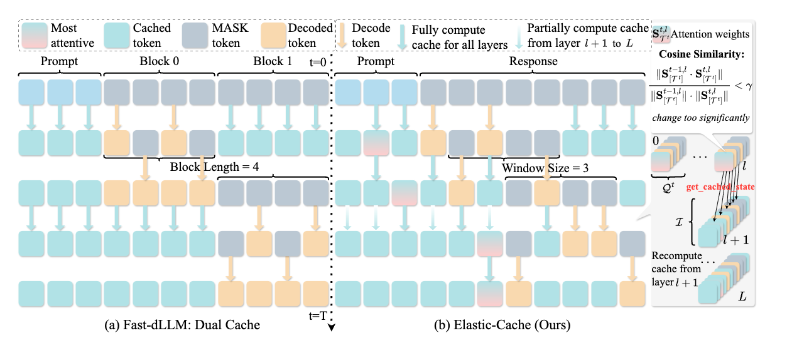
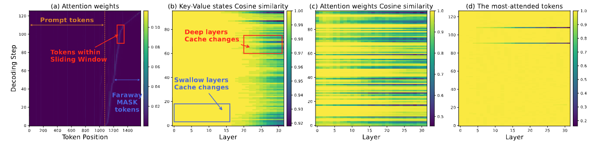
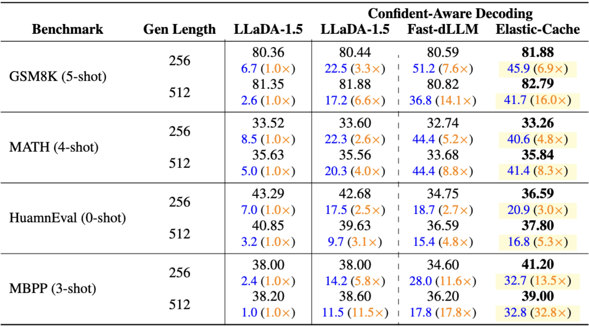

# Attention Is All You Need for KV Cache in Diffusion LLMs


<div align="center">

[Quan Nguyen-Tri](https://scholar.google.com/citations?user=TBcqxpAAAAAJ&hl=en)<sup> * </sup> &nbsp;
[Mukul Ranjan](https://mukul54.github.io/)<sup> * </sup> &nbsp;
[Zhiqiang Shen](https://zhiqiangshen.com/) &nbsp;

<sup>*</sup>Equal Contribution

[](https://arxiv.org/abs/2510.14973)
[](https://vila-lab.github.io/elastic-cache-webpage/)
[](https://vila-lab.github.io/elastic-cache-webpage/)
[](https://github.com/VILA-Lab/Elastic-Cache/issues)
[](https://github.com/VILA-Lab/Elastic-Cache/stargazers)
[](https://github.com/VILA-Lab/Elastic-Cache/blob/main/LICENSE)

</div>

---

## Elastic-Cache

**Elastic-Cache** is a training-free framework that accelerates diffusion language models through intelligent KV caching. Achieve **up to 45× speedup** while maintaining or even improving accuracy.

### Key Results

| Metric                    |       Value         |
|:-------------------------:|:------------------------:|
| **Speedup**         | Upto 16.0x (GSM8K, 512 tokens) |
| **Accuracy**        | 82.79% vs 81.35% baseline      |
| **Code Generation** | 5x faster (HumanEval)          |

---

## Method Overview

<div align="center">


*Illustration of the Key-Value cache method for diffusion LLMs. (a) The fast-dLLM (Wu et al., 2025) block-wise decoding method caches the Key-Value of all tokens outside the current block at each step. The KV cache is updated after completing a block of decoding. (b) Our proposed method, Elastic-Cache, caches the key-value of tokens outside a sliding window that flexibly moves through the sentence from left to right at each iteration. When the attention weights corresponding to the most-attended tokens (one for each layer) change significantly at a layer l, we start recomputing the KV cache from layer l + 1 to the last layer.*

</div>

Our approach introduces three complementary strategies:

1. **Sliding Window Decoding** - Flexible window that caches distant MASK tokens while computing attention for active tokens
2. **Attention-Aware Monitoring** - Track most-attended tokens and trigger updates based on attention pattern changes
3. **Layer-Aware Updates** - Selective cache refresh starting from deeper layers where changes are most significant

---

## Empirical Motivation

<div align="center">


*Visualization of our motivation. (a) MASK tokens located near each other receive high attention, while those situated far apart have minimal influence. (b) Over time, the representations in the KV states of cached tokens evolve, with deeper layers experiencing more substantial changes. (c) The changes in attention weights of most-attended tokens exhibit similar patterns to the changes in KV states of all cached tokens. (d) KV states of the most-attended tokens have the least changes.*

</div>

Our design is motivated by three key observations:

- **Spatial Locality**: Distant MASK tokens have minimal attention influence
- **Layer-wise KV Drift**: Deeper layers exhibit more significant changes over time
- **Attention Stability**: Most-attended tokens show smallest changes, serving as reliable cache validity indicators

---

## Performance Results

> <span style="color: #eb4925ff;"> A minor issue in the evaluation led to slightly inflated throughput numbers for our method on the GSM8K and MATH baselines. After correcting the evaluation, our method shows higher accuracy, with throughput slightly lower than previously reported.</span>

<div align="center">


*Comprehensive benchmark results on the LLaDA-1.5 suite. Each cell shows accuracy (top) and decoding throughput in tokens/sec with relative speedup to the LLaDA baseline (bottom, blue: t/s; orange: speedup). Bold cells denote the highest throughput and speedup per configuration.*

</div>

### Highlights

- **Training-Free**: No model modifications or retraining required
- **Architecture-Agnostic**: Works with LLaDA, Dream, LLaDA-V, and other diffusion LLMs
- **Scalable**: Better performance with longer sequences
- **Controllable Trade-offs**: Tune between accuracy and latency

---

## Installation

```bash
# Clone the repository
git clone https://github.com/VILA-Lab/elastic-cache.git
cd elastic-cache

# Install dependencies
pip install -r requirements.txt
```

---

## Usage

### Parameters

| Parameter           | Description                                             |
| ------------------- | ------------------------------------------------------- |
| `--gen_length`    | Maximum length of generated text                        |
| `--window_size`   | Sliding window length (≤ gen_length)                   |
| `--threshold`     | Confidence-aware decoding threshold                     |
| `--gamma`         | Cache update trigger threshold                          |
| `--track_num`     | Number of most-attended tokens for cache update trigger |
| `--block_caching` | Block caching for far-away [MASK] tokens                |

### Running Experiments

**LLaDA Model:**

```bash
cd llada
bash eval_{task}.sh
```

**Dream Model:**

```bash
cd dream
bash eval_{task}.sh
```

---

## Roadmap

- [✅] Serve diffusion LLMs with Elastic-Cache and batch inference
- [🚀] Triton implementation
- [🚀] Integrate into additional models (e.g., MMaDA)
- [🚀] Elastic-Cache v2

---

## Citation

```bibtex
@article{nguyen2025attention,
  title={Attention is all you need for kv cache in diffusion llms},
  author={Nguyen-Tri, Quan and Ranjan, Mukul and Shen, Zhiqiang},
  journal={arXiv preprint arXiv:2510.14973},
  year={2025}
}
```

---

## Acknowledgements

This repository is built upon [LLaDA](https://github.com/ML-GSAI/LLaDA), [Dream](https://github.com/HKUNLP/Dream), [LLaDA-V](https://github.com/ML-GSAI/LLaDA-V), and [lm-evaluation-harness](https://github.com/EleutherAI/lm-evaluation-harness).

---

## License

This project is licensed under the Apache License 2.0. See the [LICENSE](LICENSE) file for details.
